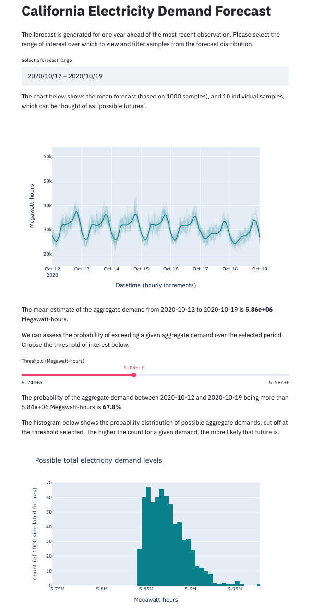
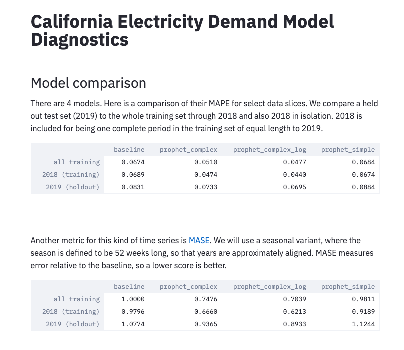

# Structural Time Series

This repo accompanies the Cloudera Fast Forward report [Structural Time Series](https://structural-time-series.fastforwardlabs.com/).
It provides an example application of generalized additive models (via the [Prophet](https://facebook.github.io/prophet/) library) to California hourly electricity demand data.

The primary output of this repository is a small application exposing a probablistic forecast and interface for asking a probabilistic question against it.
The final app looks like this.



## Structure

The folder structure of the repo is as follows

```
.
├── apps      # Two small Streamlit applications.
├── scripts   # This is where all the code that does something lives.
└── sts       # A small library of useful functions.
```

There's also an `img` folder that contains images for this README.
That folder is unimportant and you can ignore it.
Let's examine each of the important folders in turn.

### `sts`

This is a small Python library of utility functions useful to our problem.
Its structure is as follows:

```
sts
├── data
│   └── loader.py
└── models
    ├── baselines.py
    └── prophet.py
```

Building a small library of problem-specific abstractions allows us to reuse them in multiple places.
The code in `data/loader.py`, for instance, is reused in most of the scripts and applications.
In this case, we have closed model details (such as the number of Fourier terms to include in a given Prophet model) into the library.
It would be trivial to pass such arguments though, if we wanted to, for instance, perform an extensive hyperparameter search.

### `scripts`

These imperative scripts are where the work of the analysis is done.
Side-effectful actions such as I/O and model training occur in these scripts.

```
scripts
├── fit_baseline_model.py
├── fit_simple_prophet_model.py
├── fit_complex_prophet_model.py
├── fit_complex_log_prophet_model.py
├── get_csv.py
├── make_forecast.py
└── validation_metrics.py
```

### `apps`

Two applications accompany this project.
Each has a launcher script to assist launching an [Application](https://docs.cloudera.com/machine-learning/cloud/applications/topics/ml-applications.html) with CDSW/CML.
To launch the applications in another environment, run the code inside the launcher files, with the prefixed `!` removed.
You may need to specify different ports.

```
apps
├── diagnostics.py          # A model comparison and debugging assistant.
├── forecast.py             # The primary forecasting interface.
├── launch_diagnostics.py   # Launcher script for CDSW/CML
└── launch_forecast.py      # Launcher script for CDSW/CML
```

#### Diagnostics

The diagnostic application serves two purposes.
First, it computes reports top level metrics for any forecasts saved in the `data/forecasts` directory.



Second, it provides a few diagnostic charts, including a zoomable forecast.


#### Forecast

The primary forecast application (pictured at the top of this README) is a prototype user interface for the forecast this analysis generates.

## Running through the analysis

To go from a fresh clone of the repo to the final state, follow these instructions in order.

### Installation

The code and applications within were developed against Python 3.6.9, and are likely also to function with more recent versions of Python.

To install dependencies, first create and activate new virtual environment through your preferred means, then pip install from the requirements file. I recommend:

```python
python3 -m venv .venv
source .venv/bin/activate
pip install -r requirements.txt
```

In CML or CDSW, no virtual env is necessary. Instead, inside a Python 3 session, simply run

```python
!pip3 install -r requirements.txt     # notice `pip3`, not `pip`
```

Next, install the `sts` module from this repository, with

```python
pip install -e .
```

from inside the root directory of this repo.

### Data

Data source: [US Energy Information Administration](https://www.eia.gov/opendata/qb.php?category=3389936&sdid=EBA.CAL-ALL.D.H)
Data dependencies will be downloaded on first use.


## Desiderata

- Prophet strictly requires that columns are named `ds` and `y`. We have embraced this convention and coupled to it elsewhere in the codebase. A next step on building a more generically applicable application would be to decouple from this naming convention.
- By default, each time new data is fetched, it will overwrite the existing data. Similarly when a new forecast is made, it will overwrite the existing forecast. It would not be hard to adapt the code to maintain a history of fetched data or forecasts.