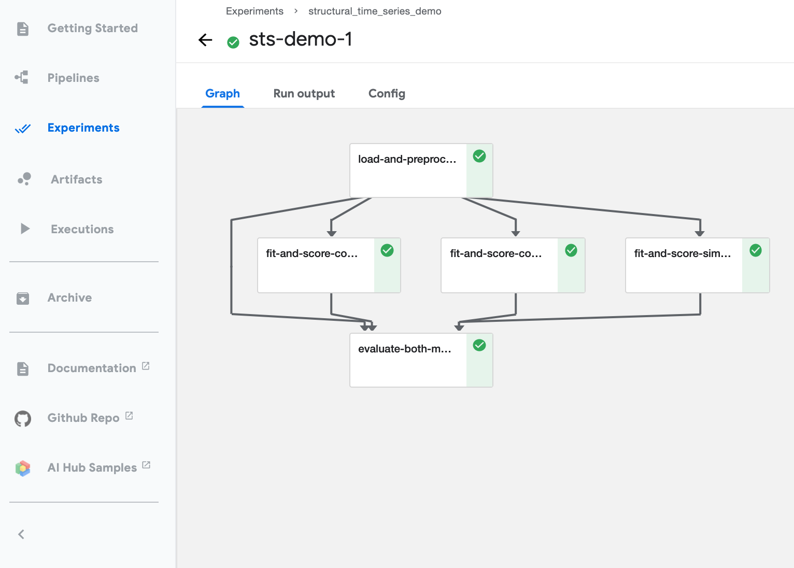
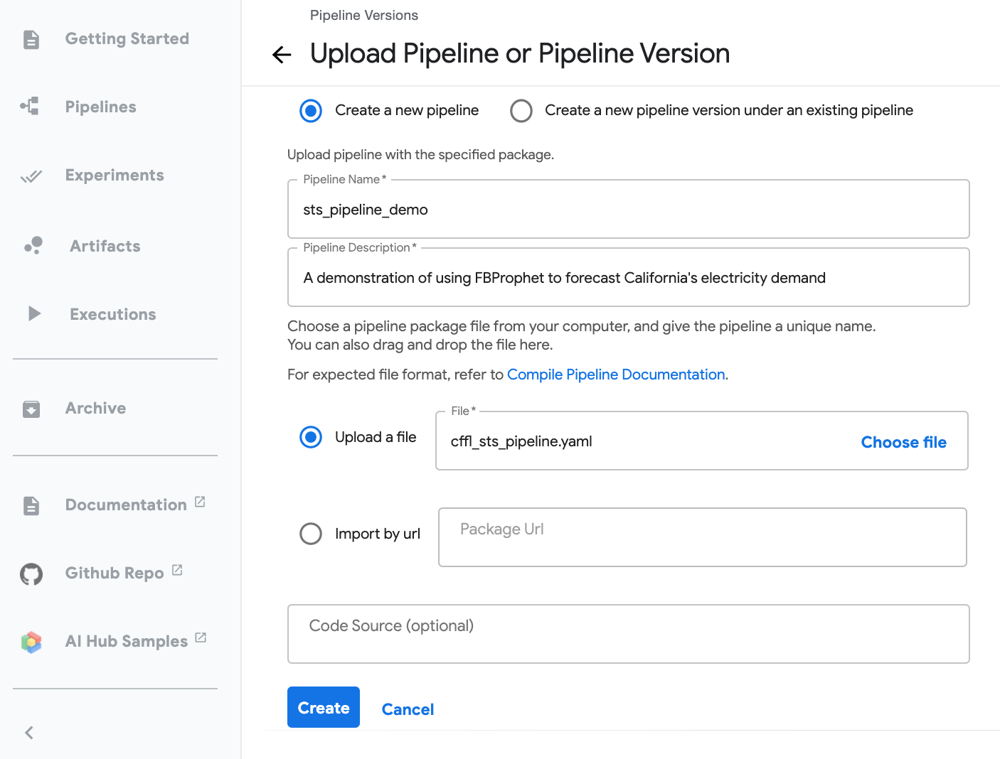
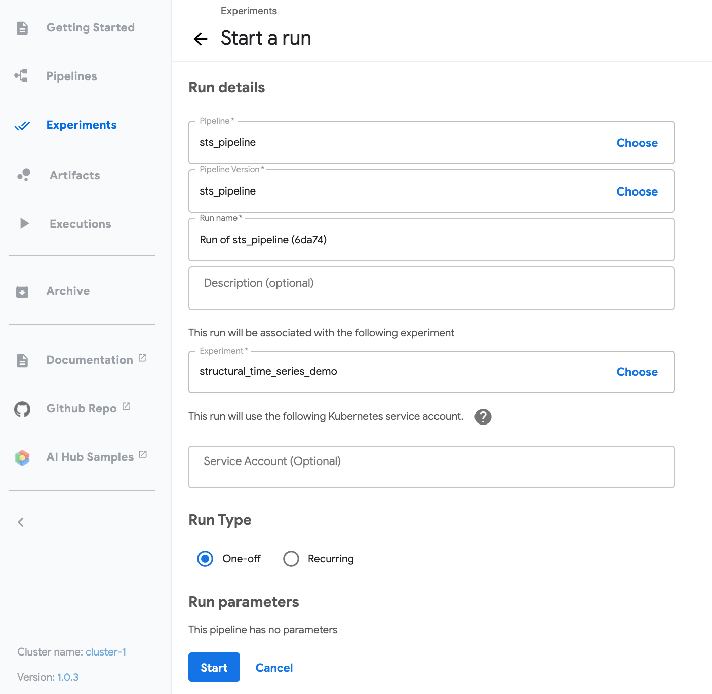

# Kubeflow Pipelines for Structural-Time-Series Forecasting




This directory contains all necessary artifacts needed to build and/or execute a [Kubeflow Pipeline](https://www.kubeflow.org/docs/pipelines/overview/pipelines-overview/) for forecasting California hourly electricity demand as described in the parent repo. The pipeline defined here executes the following steps:

1. Loads, preprocess, and splits training/validation data locally from `/data/demand.json`
2. Fits three separate forecasts on the training data in parallel
3. Evaluates each forecast on the held out validation data and signals the most performant model

> **Note** - This pipeline could easily be abstracted to take in an API Key and cloud storage locations, enabling continuously recurring runs on fresh data and saving out forecast results.


## Structure

The folder structure of this directory is as follows:

```
/kfp
├── scripts      							# Build scripts for each step in the pipeline
├── pipeline.py   						# A script that defines the kubeflow pipeline itself
└── cffl_sts_pipeline.yaml    # A portable, compiled yaml representation of the pipeline
```

It's also important to take note of the [Dockerfile](../Dockerfile) that lives in the parent directory and defines the publicly available [Docker Image](https://hub.docker.com/repository/docker/andrewrreed/cffl-sts-image) that packages the full repo and supports the Kubeflow Pipeline itself. 


## Executing the pipeline

There are two methods for executing the pipeline:

#### Kubeflow Pipelines GUI

To run the pre-compiled pipeline as defined in the `cffl_sts_pipeline.yaml` file, simply upload the `.yaml` file as-is to a deployed Kubeflow Pipelines instance:




Then, configure a run of the pipeline by selecting the newly uploaded pipeline, selecting an associated experiment, and starting a one-off run:




#### Executable Script

The pipeline can be programmatically executed from the command line following these steps:

1. Launch a terminal on the cluster where Kubeflow Pipelines is installed

2. Copy the `pipeline.py` file:

   ```bash
   wget https://raw.githubusercontent.com/andrewrreed/structural-time-series/kfp-build/kfp/pipeline.py
   ```

3. Execute the Python script by specifying the Kubeflow Pipelines host and run name:

   ```bash
   python3 pipeline.py --host <host-address> --run_name <run-name>
   ```

